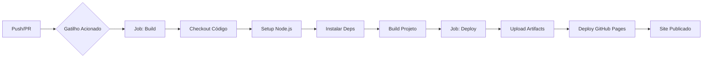

# 📘 Guia Completo: Criação do Pipeline CI/CD com GitHub Actions


## 📑 Índice

- [Introdução](#-introdução)
- [Estrutura do Pipeline](#-estrutura-do-pipeline)
- [Anatomia do Workflow](#-anatomia-do-workflow)
- [Jobs e Steps](#-jobs-e-steps)
- [Gatilhos (Triggers)](#-gatilhos-triggers)
- [Permissões](#-permissões)
- [Variáveis de Ambiente](#-variáveis-de-ambiente)
- [Passo a Passo da Criação](#-passo-a-passo-da-criação)
- [Boas Práticas](#-boas-práticas)

---

## 🎯 Introdução

O pipeline ci-cd.yaml implementa um fluxo completo de **CI/CD (Continuous Integration/Continuous Delivery)** usando GitHub Actions para automatizar o build e deploy de uma aplicação web estática no GitHub Pages.

### Por que GitHub Actions?

- ✅ **Integrado ao GitHub** - Não precisa de ferramentas externas
- ✅ **Gratuito** - Para repositórios públicos
- ✅ **Flexível** - Suporta qualquer linguagem/framework
- ✅ **Marketplace** - Milhares de actions prontas
- ✅ **Escalável** - De projetos simples a complexos

---

## 🏗️ Estrutura do Pipeline

### Localização do Arquivo

```
.github/
└── workflows/
    └── ci-cd.yaml
```

⚠️ **Importante**: A estrutura de pastas `.github/workflows/` é obrigatória. O GitHub procura automaticamente por arquivos YAML neste diretório.

### Visão Geral do Fluxo



---

## 📝 Anatomia do Workflow

### 1. Cabeçalho do Workflow

```yaml
name: CI/CD Pipeline
```

**O que faz**: Define o nome do workflow que aparecerá na aba "Actions" do GitHub.

**Boas práticas**:
- Use nomes descritivos
- Evite nomes muito longos
- Use capitalização consistente

---

### 2. Gatilhos (Triggers)

```yaml
on:
  pull_request:
    branches:
      - main

  push:
    branches:
      - main

  workflow_dispatch:
    inputs:
      description:
        description: 'Ambiente de deploy'
        required: true
        default: 'dev'
```

#### 📌 Pull Request

**Quando ativa**: Sempre que um Pull Request é aberto/atualizado para a branch `main`.

**Uso**:
- Validar código antes do merge
- Executar testes
- Prevenir bugs em produção

**Exemplo de uso**:
```bash
git checkout -b feature/nova-funcionalidade
git add .
git commit -m "feat: adicionar nova funcionalidade"
git push origin feature/nova-funcionalidade
# Abrir PR no GitHub → Pipeline executa automaticamente
```

#### 📌 Push

**Quando ativa**: Após um push direto ou merge na branch `main`.

**Uso**:
- Deploy automático em produção
- Atualizar documentação
- Gerar releases

**Exemplo de uso**:
```bash
git checkout main
git add .
git commit -m "fix: corrigir bug crítico"
git push origin main
# Pipeline executa e faz deploy automaticamente
```

#### 📌 Workflow Dispatch

**Quando ativa**: Execução manual através da interface do GitHub.

**Uso**:
- Deploys manuais
- Testes específicos
- Rollback de versões

**Como executar**:
1. Vá em **Actions** no GitHub
2. Selecione o workflow "CI/CD Pipeline"
3. Clique em **Run workflow**
4. Escolha a branch e parâmetros
5. Clique em **Run workflow** novamente

**Inputs configuráveis**:
```yaml
inputs:
  description:
    description: 'Ambiente de deploy'  # Label que aparece na UI
    required: true                     # Campo obrigatório
    default: 'dev'                     # Valor padrão
```

---

### 3. Permissões

```yaml
permissions:
  contents: read      # Ler conteúdo do repositório
  pages: write        # Escrever no GitHub Pages
  id-token: write     # Gerar tokens de autenticação
```

**Por que são necessárias**:
- `contents: read` - Para fazer checkout do código
- `pages: write` - Para fazer deploy no GitHub Pages
- `id-token: write` - Para autenticação segura entre jobs

**Níveis de permissão**:
- `read` - Apenas leitura
- `write` - Leitura e escrita
- `none` - Sem acesso

---

### 4. Variáveis de Ambiente

```yaml
env:
  environment: "dev"
```

**O que são**: Variáveis globais disponíveis em todos os jobs.

**Exemplo de uso no workflow**:
```yaml
steps:
  - name: Mostrar ambiente
    run: echo "Deploy no ambiente: ${{ env.environment }}"
```

**Escopo**:
- `env` no nível raiz → Todas as jobs
- `env` dentro de job → Apenas aquela job
- `env` dentro de step → Apenas aquele step

---

## 🔧 Jobs e Steps

### Job 1: Build

```yaml
build:
  runs-on: ubuntu-latest
  
  steps:
    - name: Checkout do código
      uses: actions/checkout@v4
    
    - name: Configurar Node.js
      uses: actions/setup-node@v4
      with:
        node-version: "18"
    
    - name: Instalar dependências
      run: npm install
    
    - name: Build do projeto
      run: npm run build
```

#### 🖥️ Runner: `ubuntu-latest`

**O que é**: Uma máquina virtual Linux fornecida pelo GitHub.

**Opções disponíveis**:
- `ubuntu-latest` - Ubuntu mais recente (recomendado)
- `ubuntu-22.04` - Ubuntu 22.04 específico
- `windows-latest` - Windows Server
- `macos-latest` - macOS

**Especificações típicas**:
- 2-core CPU
- 7 GB RAM
- 14 GB SSD

#### 📦 Step 1: Checkout do Código

```yaml
- name: Checkout do código
  uses: actions/checkout@v4
```

**O que faz**: Clona o repositório para o runner.

**Por que é necessário**: Sem este step, o runner não tem acesso ao código.

**Versão `@v4`**: Sempre use a versão mais recente para segurança e performance.

#### ⚙️ Step 2: Configurar Node.js

```yaml
- name: Configurar Node.js
  uses: actions/setup-node@v4
  with:
    node-version: "18"
```

**O que faz**: Instala o Node.js versão 18 no runner.

**Parâmetro `with`**: Passa configurações para a action.

**Outras opções**:
```yaml
with:
  node-version: "18"
  cache: 'npm'              # Cache de dependências
  registry-url: 'https://registry.npmjs.org'
```

#### 📥 Step 3: Instalar Dependências

```yaml
- name: Instalar dependências
  run: npm install
```

**O que faz**: Executa `npm install` para instalar pacotes do `package.json`.

**Alternativas**:
```yaml
run: npm ci  # Mais rápido, usa package-lock.json
run: npm install --production  # Apenas deps de produção
```

#### 🏗️ Step 4: Build do Projeto

```yaml
- name: Build do projeto
  run: npm run build
```

**O que faz**: Executa o script de build definido no `package.json`.

**Exemplo de `package.json`**:
```json
{
  "scripts": {
    "build": "webpack --mode production"
  }
}
```

---

### Job 2: Deploy

```yaml
deploy:
  environment:
    name: github-pages
    url: ${{ steps.deployment.outputs.page_url }}
  runs-on: ubuntu-latest
  
  steps:
    - name: Checkout
      uses: actions/checkout@v4
    
    - name: Setup Pages
      uses: actions/configure-pages@v5
    
    - name: Upload artifact
      uses: actions/upload-pages-artifact@v3
      with:
        path: '.'
    
    - name: Deploy to GitHub Pages
      id: deployment
      uses: actions/deploy-pages@v4
```

#### 🌍 Configuração de Ambiente

```yaml
environment:
  name: github-pages
  url: ${{ steps.deployment.outputs.page_url }}
```

**O que faz**: 
- Define um ambiente de deployment
- Captura a URL do site publicado
- Permite configurar proteções e secrets por ambiente

#### 📤 Step 3: Upload Artifact

```yaml
- name: Upload artifact
  uses: actions/upload-pages-artifact@v3
  with:
    path: '.'
```

**O que faz**: Empacota os arquivos para upload.

**Parâmetro `path`**:
- `'.'` - Todo o repositório
- `'dist/'` - Apenas a pasta dist
- `'build/'` - Apenas a pasta build

#### 🚀 Step 4: Deploy to GitHub Pages

```yaml
- name: Deploy to GitHub Pages
  id: deployment
  uses: actions/deploy-pages@v4
```

**O que faz**: Publica os arquivos no GitHub Pages.

**Parâmetro `id`**: Permite referenciar outputs deste step em outros lugares.

---

## 🎯 Passo a Passo da Criação

### Passo 1: Criar a Estrutura de Pastas

```bash
mkdir -p .github/workflows
cd .github/workflows
```

### Passo 2: Criar o Arquivo YAML

```bash
touch ci-cd.yaml
```

ou no Windows:
```powershell
New-Item -Path .github\workflows\ci-cd.yaml -ItemType File
```

### Passo 3: Definir o Nome do Workflow

```yaml
name: CI/CD Pipeline
```

### Passo 4: Configurar os Gatilhos

```yaml
on:
  push:
    branches:
      - main
  pull_request:
    branches:
      - main
  workflow_dispatch:
```

### Passo 5: Definir Permissões

```yaml
permissions:
  contents: read
  pages: write
  id-token: write
```

### Passo 6: Criar o Job de Build

```yaml
jobs:
  build:
    runs-on: ubuntu-latest
    steps:
      - uses: actions/checkout@v4
      - uses: actions/setup-node@v4
        with:
          node-version: "18"
      - run: npm install
      - run: npm run build
```

### Passo 7: Criar o Job de Deploy

```yaml
  deploy:
    runs-on: ubuntu-latest
    environment:
      name: github-pages
      url: ${{ steps.deployment.outputs.page_url }}
    steps:
      - uses: actions/checkout@v4
      - uses: actions/configure-pages@v5
      - uses: actions/upload-pages-artifact@v3
        with:
          path: '.'
      - id: deployment
        uses: actions/deploy-pages@v4
```

### Passo 8: Commit e Push

```bash
git add .github/workflows/ci-cd.yaml
git commit -m "ci: adicionar pipeline CI/CD"
git push origin main
```

### Passo 9: Verificar Execução

1. Acesse **Actions** no GitHub
2. Veja o workflow em execução
3. Clique para ver logs detalhados

---

## ✅ Boas Práticas

### 1. Versionamento de Actions

❌ **Evite**:
```yaml
uses: actions/checkout@master  # Branch instável
uses: actions/checkout         # Sem versão
```

✅ **Prefira**:
```yaml
uses: actions/checkout@v4      # Versão major
uses: actions/checkout@v4.1.2  # Versão exata
```

### 2. Segredos e Variáveis Sensíveis

❌ **NUNCA faça**:
```yaml
env:
  API_KEY: "minha-chave-secreta-123"  # Exposto no código!
```

✅ **Use Secrets**:
```yaml
env:
  API_KEY: ${{ secrets.API_KEY }}  # Seguro
```

**Como adicionar Secrets**:
1. Settings → Secrets and variables → Actions
2. New repository secret
3. Nome: `API_KEY`
4. Valor: sua chave

### 3. Cache de Dependências

✅ **Otimize instalações**:
```yaml
- uses: actions/setup-node@v4
  with:
    node-version: "18"
    cache: 'npm'  # Cache automático
```

### 4. Condições e Dependências entre Jobs

```yaml
jobs:
  build:
    runs-on: ubuntu-latest
    steps:
      - run: echo "Building..."
  
  deploy:
    needs: build  # Só executa se build passar
    if: github.ref == 'refs/heads/main'  # Só na main
    runs-on: ubuntu-latest
    steps:
      - run: echo "Deploying..."
```

### 5. Timeouts

```yaml
jobs:
  build:
    runs-on: ubuntu-latest
    timeout-minutes: 10  # Cancela após 10min
```

### 6. Nomeação Clara

✅ **Bom**:
```yaml
- name: Executar testes unitários com cobertura
  run: npm test -- --coverage
```

❌ **Ruim**:
```yaml
- name: Step 3
  run: npm test
```

---

## 🐛 Troubleshooting

### Problema 1: Workflow não executa

**Sintomas**: Nada aparece na aba Actions após push.

**Soluções**:
```bash
# Verificar se o arquivo está no lugar certo
ls -la .github/workflows/

# Verificar sintaxe YAML
# Use um validador online ou:
yamllint .github/workflows/ci-cd.yaml
```

### Problema 2: Permissões negadas

**Erro**: `Permission denied` ou `403 Forbidden`

**Solução**:
1. Settings → Actions → General
2. Workflow permissions → Read and write
3. Save

### Problema 3: Build falha

**Sintomas**: Job build falha na instalação ou build.

**Diagnóstico**:
```yaml
- name: Debug - Listar arquivos
  run: ls -la

- name: Debug - Verificar Node
  run: |
    node --version
    npm --version

- name: Debug - Ver package.json
  run: cat package.json
```

### Problema 4: Deploy não funciona

**Checklist**:
- [ ] GitHub Pages está habilitado
- [ ] Source está em "GitHub Actions"
- [ ] Permissões estão corretas
- [ ] Artifacts foram criados

**Ver artifacts**:
```yaml
- name: Debug - Listar arquivos para deploy
  run: ls -la dist/  # ou build/
```

### Problema 5: Secrets não funcionam

**Erro**: Variável vazia ou undefined

**Verificar**:
```yaml
- name: Verificar secret
  run: |
    if [ -z "${{ secrets.API_KEY }}" ]; then
      echo "Secret não configurado!"
      exit 1
    fi
```

---

## 📊 Monitoramento e Logs

### Visualizar Logs

1. Acesse **Actions**
2. Clique no workflow
3. Clique no job
4. Clique no step para ver detalhes

### Adicionar Logs Personalizados

```yaml
- name: Meu step
  run: |
    echo "::notice::Informação importante"
    echo "::warning::Aviso sobre algo"
    echo "::error::Erro encontrado"
```

### Outputs entre Steps

```yaml
- name: Gerar versão
  id: version
  run: echo "tag=v1.0.0" >> $GITHUB_OUTPUT

- name: Usar versão
  run: echo "Versão: ${{ steps.version.outputs.tag }}"
```

---

## 🚀 Próximos Passos

Após dominar este pipeline básico, explore:

1. **Matrix Builds** - Testar em múltiplas versões
   ```yaml
   strategy:
     matrix:
       node-version: [16, 18, 20]
   ```

2. **Ambientes Múltiplos** - Dev, Staging, Production
3. **Notificações** - Slack, Discord, Email
4. **Testes Automatizados** - Unit, Integration, E2E
5. **Code Quality** - ESLint, Prettier, SonarQube
6. **Security Scanning** - Dependabot, CodeQL
7. **Docker** - Containerização
8. **Kubernetes** - Orquestração

---

## 📚 Recursos Adicionais

- [Documentação Oficial GitHub Actions](https://docs.github.com/actions)
- [GitHub Actions Marketplace](https://github.com/marketplace?type=actions)
- [Awesome GitHub Actions](https://github.com/sdras/awesome-actions)
- [GitHub Actions Cheat Sheet](https://github.github.io/actions-cheat-sheet/)

---

<div align="center">

**Criado para o Curso DevOps ZTM** 🚀

*Pipeline CI/CD com GitHub Actions*

</div>
